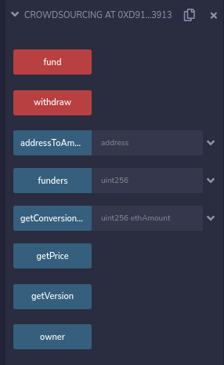

# CrowdSourcing Dapp:

## CrowdSourcig Smart contract version 1.0: 

This ia a simple but effective crowdsourcing Smart Contract where user can fund and an admin can withdraw those funds to spend on stuff.

### About the smart contract:

- **Admin /Owner/Fundriser** can withdraw funds from the smart contract.
- **Funders** can fund ETH to the smart contract.
- If we search the smart contract address in the test network etherscan , we can see the funds received and withdrawn. Each block is added to the blockchain if user perform state changing activities in the smart contract.
- It shows the Owner public key.Owner is someone who deploy the smart contract for the first time. 
- Any public key can be Funder and give money to the smart contarct.
- Smart contract Address changes if we re-deploy the smart contract in the remix.       

### Deployed Smart Contract:

